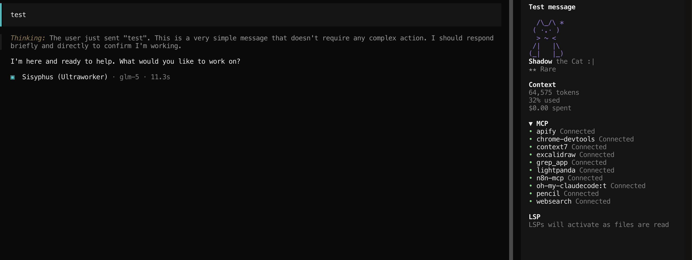

# cligochi

A virtual pet companion for [OpenCode](https://opencode.ai) — raise a pet while you code.

```
  /\_/\
 ( ^.^ )
  > ^ <
 /|   |\
(_|   |_)
```



Your pet reacts to your coding activity: commits, test runs, errors, file saves, and more. Each pet has a rarity tier, unique ASCII art, and Fallout-style S.P.E.C.I.A.L. stats.

## Features

- 60+ unique pets across 16 species (cats, dogs, dragons, robots, owls, ghosts, penguins...)
- Rarity tiers: Common, Uncommon, Rare, Epic, Legendary
- Random pet assignment with weighted probability
- S.P.E.C.I.A.L. stats (Strength, Perception, Endurance, Charisma, Intelligence, Agility, Luck)
- Mood system based on coding activity
- Unlockable traits (cautious, nocturnal, speedster, stubborn, wise, polyglot)
- Sidebar widget with live pet display
- Interactive commands: status, pet, feed

## Install

Tell OpenCode:

> Fetch and follow instructions from https://raw.githubusercontent.com/jamakase/cligochi/main/.opencode/INSTALL.md

Or manually add to your OpenCode config (`~/.config/opencode/opencode.json`):

```json
{
  "plugin": ["cligochi"]
}
```

Restart OpenCode. That's it — the plugin auto-installs.

## Usage

Type `/cligochi` in OpenCode:

- **First run**: A mystery present appears in the sidebar. Run the command to roll your random pet with rarity and S.P.E.C.I.A.L. stats.
- **After that**: Opens an action menu:
  - **Status** — View your pet's full stats
  - **Pet** — Give your pet some love (+happiness)
  - **Feed** — Feed your hungry pet (+hunger)

Your pet also reacts automatically to:
- File saves
- Git commits
- Test passes/failures
- Errors
- Force pushes (they don't like those)
- Idle time

## Rarity

| Tier | Weight | Examples |
|------|--------|---------|
| Common | 100 | Most generated pets |
| Uncommon | 40 | Pets with high trait modifiers |
| Rare | 15 | Pets with accessories |
| Epic | 5 | Byte the Robot |
| Legendary | 2 | Whiskers the Cat, Ember the Dragon |

## License

MIT
